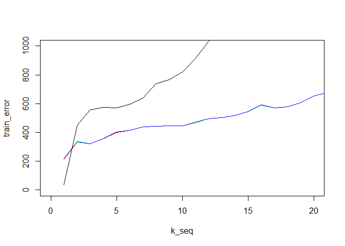
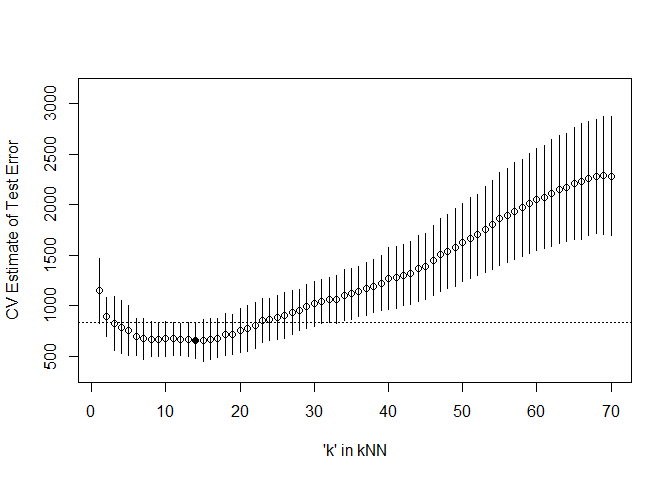

Homework 2
================
Anthony DeNiro
March 19, 2020

``` r
library(MASS)
library(manipulate) 
library(glmnet)
```

    ## Warning: package 'glmnet' was built under R version 3.6.2

    ## Loading required package: Matrix

    ## Loaded glmnet 3.0-2

``` r
library(caret)
```

    ## Warning: package 'caret' was built under R version 3.6.2

    ## Loading required package: lattice

    ## Loading required package: ggplot2

``` r
mcycle <- mcycle
```

1.
--

``` r
trainInd <- sample(1:nrow(mcycle), floor(nrow(mcycle)) * 0.75, replace = F)
mcycle_train <- mcycle[trainInd,]
mcycle_test <- mcycle[-trainInd,]
```

2.
--

creating predictions using training data

``` r
x <- matrix(mcycle_train$times, length(mcycle_train$times), 1)
y <- mcycle_train$accel

kernel_k_nearest_neighbors <- function(x, x0, k_)
{
  ## compute distance betwen each x and x0
  z <- t(t(x) - x0)
  d <- sqrt(rowSums(z*z))
  
  ## initialize kernel weights to zero
  w <- rep(0, length(d))
  
  ## set weight to 1 for k nearest neighbors
  w[order(d)[1:k_]] <- 1
  
  return(w)
}

## y  - n x 1 vector of training outputs
## x  - n x p matrix of training inputs
## x0 - m x p matrix where to make predictions
## kern  - kernel function to use
## ... - arguments to pass to kernel function
nadaraya_watson <- function(y, x, x0, kern, ...) 
{
  k <- t(apply(x0, 1, function(x0_) 
  {
    k_ <- kern(x, x0_, ...)
    k_/sum(k_)
  }))
  yhat <- drop(k %*% y)
  attr(yhat, 'k') <- k
  return(yhat)
}

#y_hat <- nadaraya_watson(y, x, x, kernel_k_nearest_neighbors, k_ = 5)
#ength(y_hat)
set.seed(320)

k_seq <- seq(1,70,1)
matrix_train_pred <- matrix(nrow = 70, ncol = nrow(mcycle_train))
for(i in seq_along(k_seq))
{
  y_hat <- nadaraya_watson(y, x, x, kernel_k_nearest_neighbors, k_ = k_seq[i])
  matrix_train_pred[i,] <- y_hat
}
```

3.
--

predictions for the validation data

``` r
x2 <- matrix(mcycle_test$times, length(mcycle_test$times), 1)
y2 <- mcycle_test$accel

k_seq2 <- seq(1,34,1)
matrix_test_pred <- matrix(nrow = 34, ncol = nrow(mcycle_test))
for(i in seq_along(k_seq2))
{
  y_hat <- nadaraya_watson(y2, x2, x2, kernel_k_nearest_neighbors, k_ = k_seq2[i])
  matrix_test_pred[i,] <- y_hat
}
```

error plot

``` r
loss_squared_error <- function(y, yhat)
  (y - yhat)^2

## test/train error
## y    - train/test y
## yhat - predictions at train/test x
## loss - loss function
error <- function(y, yhat, loss=loss_squared_error)
  mean(loss(y, yhat))

## Compute effective df using NW method
## y  - n x 1 vector of training outputs
## x  - n x p matrix of training inputs
## kern  - kernel function to use
## ... - arguments to pass to kernel function
effective_df <- function(y, x, kern, ...) {
  y_hat <- nadaraya_watson(y, x, x,
                           kern=kern, ...)
  sum(diag(attr(y_hat, 'k')))
}

## AIC
## y    - training y
## yhat - predictions at training x
## d    - effective degrees of freedom
aic <- function(y, yhat, d)
  error(y, yhat) + 2/length(y)*d

## BIC
## y    - training y
## yhat - predictions at training x
## d    - effective degrees of freedom
bic <- function(y, yhat, d)
  error(y, yhat) + log(length(y))/length(y)*d

## compute effective degrees of freedom
edf_vec <- vector("numeric", 70)

for(i in seq_along(k_seq))
{
  edf <- effective_df(y, x, kernel_k_nearest_neighbors, k_ = k_seq[i])
  edf_vec[i] <- edf
}


train_error <- vector("numeric", 70)
test_error <- vector("numeric", 34)
aic_error <- vector("numeric", 70)
bic_error <- vector("numeric", 70)

for(i in 1:nrow(matrix_train_pred))
{
  train_error[i] <- error(y, matrix_train_pred[i,])
  aic_error[i] <- aic(y, matrix_train_pred[i,], edf_vec[i])
  bic_error[i] <- bic(y, matrix_train_pred[i,], edf_vec[i])
}

for(i in 1:nrow(matrix_test_pred))
{
  test_error[i] <- error(y2, matrix_test_pred[i,])
}


{plot(k_seq, train_error, type = "l", col = "red", xlim = c(0, 20), ylim = c(0, 1000))
  lines(k_seq, aic_error, type = "l", col = "green")
  lines(k_seq, bic_error, type = "l", col = "blue")
  lines(k_seq2, test_error, type = "l", col = "black")
}
```



``` r
error_matrix <- as.data.frame(rbind(train_error, aic_error, bic_error))

error_matrix
```

    ##                   V1       V2       V3       V4       V5       V6       V7
    ## train_error 216.0687 332.5197 320.2551 356.5327 401.4138 414.8425 440.0579
    ## aic_error   217.6444 333.4490 320.9015 357.0327 401.8138 415.1758 440.3436
    ## bic_error   219.6891 334.6548 321.7403 357.6815 402.3328 415.6084 440.7143
    ##                   V8       V9      V10      V11      V12      V13      V14
    ## train_error 441.4351 447.1907 445.3417 469.1441 494.8812 502.1978 517.3643
    ## aic_error   441.6851 447.4129 445.5417 469.3259 495.0479 502.3517 517.5072
    ## bic_error   442.0095 447.7012 445.8012 469.5618 495.2641 502.5513 517.6926
    ##                  V15      V16      V17      V18      V19      V20      V21
    ## train_error 546.7873 590.1808 572.1818 578.2025 607.8151 653.6500 679.1858
    ## aic_error   546.9206 590.3058 572.2994 578.3136 607.9204 653.7500 679.2811
    ## bic_error   547.0936 590.4679 572.4521 578.4578 608.0570 653.8798 679.4046
    ##                  V22      V23      V24      V25      V26      V27      V28
    ## train_error 710.5292 757.5644 773.3606 814.7961 850.0748 889.8085 933.4589
    ## aic_error   710.6201 757.6513 773.4439 814.8761 850.1517 889.8826 933.5303
    ## bic_error   710.7381 757.7642 773.5520 814.9799 850.2515 889.9787 933.6230
    ##                  V29      V30      V31      V32      V33      V34      V35
    ## train_error 964.6654 966.8208 1007.471 1041.494 1064.479 1086.123 1118.014
    ## aic_error   964.7344 966.8875 1007.535 1041.557 1064.540 1086.181 1118.071
    ## bic_error   964.8239 966.9740 1007.619 1041.638 1064.619 1086.258 1118.145
    ##                  V36      V37      V38      V39      V40      V41      V42
    ## train_error 1150.172 1181.476 1215.763 1247.882 1269.927 1319.370 1376.380
    ## aic_error   1150.228 1181.530 1215.816 1247.933 1269.977 1319.418 1376.428
    ## bic_error   1150.300 1181.600 1215.884 1248.000 1270.042 1319.482 1376.490
    ##                  V43      V44      V45      V46      V47      V48      V49
    ## train_error 1420.052 1466.854 1529.256 1578.685 1633.934 1701.963 1757.376
    ## aic_error   1420.099 1466.899 1529.301 1578.728 1633.977 1702.004 1757.417
    ## bic_error   1420.159 1466.958 1529.358 1578.785 1634.032 1702.058 1757.470
    ##                  V50      V51      V52      V53      V54      V55      V56
    ## train_error 1814.437 1878.147 1938.525 1986.934 2027.134 2088.433 2130.379
    ## aic_error   1814.477 1878.186 1938.564 1986.972 2027.171 2088.469 2130.414
    ## bic_error   1814.529 1878.237 1938.614 1987.021 2027.219 2088.516 2130.461
    ##                  V57      V58      V59      V60      V61      V62      V63
    ## train_error 2175.035 2204.879 2266.435 2315.341 2342.917 2363.335 2383.729
    ## aic_error   2175.070 2204.913 2266.469 2315.374 2342.950 2363.367 2383.761
    ## bic_error   2175.115 2204.958 2266.513 2315.417 2342.992 2363.409 2383.802
    ##                  V64      V65      V66      V67      V68      V69      V70
    ## train_error 2402.500 2420.342 2430.623 2436.616 2447.198 2453.875 2450.355
    ## aic_error   2402.532 2420.373 2430.653 2436.646 2447.228 2453.904 2450.383
    ## bic_error   2402.572 2420.413 2430.693 2436.684 2447.266 2453.942 2450.420

our training error, bic, and aic lines are hard to tell from each other, but they are different values, as shown in the dataframe

4.
--

5 fold CV for KNN model

``` r
## 5-fold cross-validation of knnreg model
## create five folds
set.seed(1985)
inc_flds  <- createFolds(mcycle$accel, k=5)
#print(inc_flds)
sapply(inc_flds, length)  ## not all the same length
```

    ## Fold1 Fold2 Fold3 Fold4 Fold5 
    ##    26    28    26    27    26

``` r
cvknnreg <- function(kNN = 10, flds=inc_flds) {
  cverr <- rep(NA, length(flds))
  for(tst_idx in 1:length(flds)) 
  { ## for each fold
    
        ## get training and testing data
    inc_trn <- mcycle[-flds[[tst_idx]],]
    inc_tst <- mcycle[ flds[[tst_idx]],]
    
    
    ## fit kNN model to training data
    knn_fit <- knnreg(accel ~ times,
                      k=kNN, data= inc_trn)
    
    ## compute test error on testing data
    pre_tst <- predict(knn_fit, inc_tst)
    cverr[tst_idx] <- mean((inc_tst$accel - pre_tst)^2)
  }
  return(cverr)
}

## Compute 5-fold CV for kNN = 1:20
cverrs <- sapply(1:70, cvknnreg)
cverrs_mean <- apply(cverrs, 2, mean)
cverrs_sd   <- apply(cverrs, 2, sd)
```

5.
--

Plot results of 5-fold CV for kNN = 1:70

``` r
plot(x=1:70, y=cverrs_mean, 
     ylim=range(cverrs),
     xlab="'k' in kNN", ylab="CV Estimate of Test Error")
segments(x0=1:70, x1=1:70,
         y0=cverrs_mean-cverrs_sd,
         y1=cverrs_mean+cverrs_sd)
best_idx <- which.min(cverrs_mean)
points(x=best_idx, y=cverrs_mean[best_idx], pch=20)
abline(h=cverrs_mean[best_idx] + cverrs_sd[best_idx], lty=3)
```



6.
--

This figure gives us the average test error as well as the values one standard error away from the mean for each knn prediction model, varying k, the number of points in our neighborhood, from 1 to 70. We see that k = 15 gives us the lowest test error but we want to apply the parismony principle and select the model that is not as complex, yet still gives us a good estimate of test error. k = 23 is the model I would select since it's mean is one standard error away. Now we have a less complex model and a similar test error.
