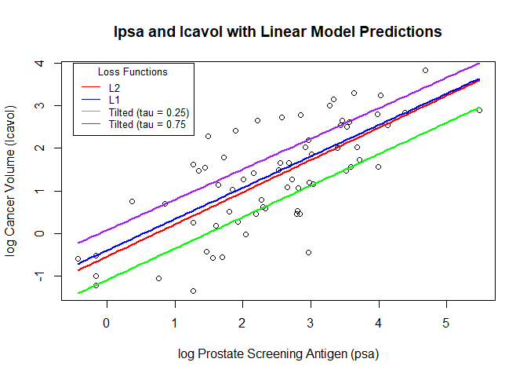
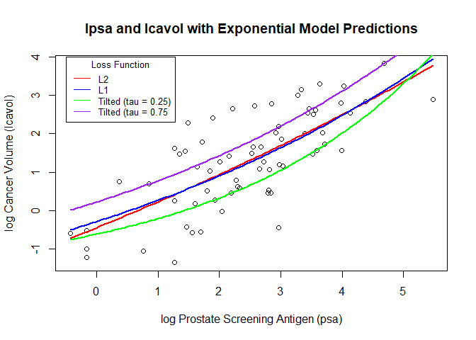

Homework 1
================
Anthony DeNiro
January 15, 2020

libraries and packages

``` r
#install.packages('ElemStatLearn')
library('ElemStatLearn')
```

    ## Warning: package 'ElemStatLearn' was built under R version 3.6.2

load data

``` r
## load prostate data
data("prostate")
#?prostate()
#View(prostate)
```

subset data

``` r
## subset to training examples
prostate_train <- subset(prostate, train==TRUE)
```

Loss Functions

``` r
## L2 loss function
L2_loss <- function(y, yhat)
{
  (y-yhat)^2
}

## L1 loss function
L1_loss <- function(y, yhat)
{
  abs(y-yhat)
}

## tilted, vectorized not supported
tilted_loss_0.25 <- function(y, yhat)
{
  ifelse(y - yhat > 0, 0.25*(y - yhat), (0.25-1)*(y - yhat))
}

tilted_loss_0.75 <- function(y, yhat)
{
  ifelse(y - yhat > 0, 0.75*(y - yhat), (0.75-1)*(y - yhat))
}
```

Plot lpsa and lcavol

``` r
## plot lcavol vs lpsa
plot_psa_data <- function(dat=prostate_train, mod)
{
  if(mod == 1)
  {
    plot(dat$lpsa, dat$lcavol,
       xlab="log Prostate Screening Antigen (psa)",
       ylab="log Cancer Volume (lcavol)",
       main = "lpsa and lcavol with Linear Model Predictions")
  }
  else if(mod == 2)
  {
    plot(dat$lpsa, dat$lcavol,
       xlab="log Prostate Screening Antigen (psa)",
       ylab="log Cancer Volume (lcavol)",
       main = "lpsa and lcavol with Exponential Model Predictions")
  }
  
}
#plot_psa_data()
```

fit linear model function

``` r
## fit simple linear model using numerical optimization
fit_lin <- function(y, x, loss, beta_init)
{
  err <- function(beta)
  {
    mean(loss(y,  beta[1] + beta[2]*x))
  }
  beta <- optim(par = beta_init, fn = err)
  return(beta)
}
```

predict from linear model function

``` r
## make predictions from linear model
predict_lin <- function(x, beta)
{
  beta[1] + beta[2]*x
}
```

fit linear models

``` r
## fit linear model
lin_beta_L2 <- fit_lin(y=prostate_train$lcavol,
                    x=prostate_train$lpsa,
                    loss=L2_loss,
                    beta_init = c(-0.51, 0.75))

lin_beta_L1 <- fit_lin(y=prostate_train$lcavol,
                    x=prostate_train$lpsa,
                    loss=L1_loss,
                    beta_init = c(-0.51, 0.75))

lin_beta_tilt_0.25 <- fit_lin(y=prostate_train$lcavol,
                    x=prostate_train$lpsa,
                    loss= tilted_loss_0.25,
                    beta_init = c(-0.51, 0.75))

lin_beta_tilt_0.75 <- fit_lin(y=prostate_train$lcavol,
                    x=prostate_train$lpsa,
                    loss= tilted_loss_0.75,
                    beta_init = c(-0.51, 0.75))
```

linear model predicitons

``` r
## compute predictions for a grid of inputs
x_grid <- seq(min(prostate_train$lpsa),
              max(prostate_train$lpsa),
              length.out=100)

lin_pred_L2 <- predict_lin(x=x_grid, beta=lin_beta_L2$par)

lin_pred_L1 <- predict_lin(x=x_grid, beta=lin_beta_L1$par)

lin_pred_tilt_0.25 <- predict_lin(x=x_grid, beta=lin_beta_tilt_0.25$par)

lin_pred_tilt_0.75 <- predict_lin(x=x_grid, beta=lin_beta_tilt_0.75$par)
```

Make plot

``` r
## plot predictions
{plot_psa_data(mod = 1)
lines(x=x_grid, y=lin_pred_L2, col = 'red', lwd = 2)
lines(x=x_grid, y=lin_pred_L1, col = 'blue', lwd = 2)
lines(x=x_grid, y=lin_pred_tilt_0.25, col = 'green', lwd = 2)
lines(x=x_grid, y=lin_pred_tilt_0.75, col = 'purple', lwd = 2)
legend(-0.5, 4, legend=c("L2", "L1", "Tilted (tau = 0.25)", "Tilted (tau = 0.75"),
         col=c("red", "blue", "green", "purple"), lty=1, cex=0.8, title = "Loss Functions")}
```



exponential model fit function

``` r
fit_exp <- function(y, x, loss, beta_init)
{
  err <- function(beta)
  {
    mean(loss(y,  beta[1] + beta[2]*exp(-beta[3]*x)))
  }
  beta <- optim(par = beta_init, fn = err)
  return(beta)
}
```

predict from exponential function

``` r
predict_exp <- function(x, beta)
{
  beta[1] + beta[2]*exp(-beta[3]*x)
}
```

fit exponential models

``` r
## fit linear model
exp_beta_L2 <- fit_exp(y=prostate_train$lcavol,
                    x=prostate_train$lpsa,
                    loss=L2_loss,
                    beta_init = c(-1.0, 0.0, -0.3))

exp_beta_L1 <- fit_exp(y=prostate_train$lcavol,
                    x=prostate_train$lpsa,
                    loss=L1_loss,
                    beta_init = c(-1.0, 0.0, -0.3))

exp_beta_tilt_0.25 <- fit_exp(y=prostate_train$lcavol,
                    x=prostate_train$lpsa,
                    loss= tilted_loss_0.25,
                    beta_init = c(-1.0, 0.0, -0.3))

exp_beta_tilt_0.75 <- fit_exp(y=prostate_train$lcavol,
                    x=prostate_train$lpsa,
                    loss= tilted_loss_0.75,
                    beta_init = c(-1.0, 0.0, -0.3))
```

exponential model predicitons

``` r
## compute predictions for a grid of inputs
x_grid <- seq(min(prostate_train$lpsa),
              max(prostate_train$lpsa),
              length.out=100)

exp_pred_L2 <- predict_exp(x=x_grid, beta=exp_beta_L2$par)

exp_pred_L1 <- predict_exp(x=x_grid, beta=exp_beta_L1$par)

exp_pred_tilt_0.25 <- predict_exp(x=x_grid, beta=exp_beta_tilt_0.25$par)

exp_pred_tilt_0.75 <- predict_exp(x=x_grid, beta=exp_beta_tilt_0.75$par)
```

Make plot

``` r
## plot predictions
{plot_psa_data(mod = 2)
lines(x=x_grid, y=exp_pred_L2, col = 'red', lwd = 2)
lines(x=x_grid, y=exp_pred_L1, col = 'blue', lwd = 2)
lines(x=x_grid, y=exp_pred_tilt_0.25, col = 'green', lwd = 2)
lines(x=x_grid, y=exp_pred_tilt_0.75, col = 'purple', lwd = 2)
legend(-0.5, 4, legend=c("L2", "L1", "Tilted (tau = 0.25)", "Tilted (tau = 0.75"),
         col=c("red", "blue", "green", "purple"), lty=1, cex=0.8, title = "Loss Function")}
```


