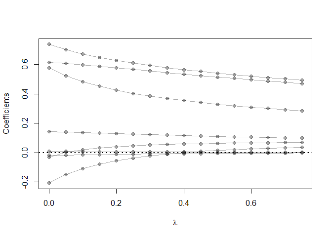
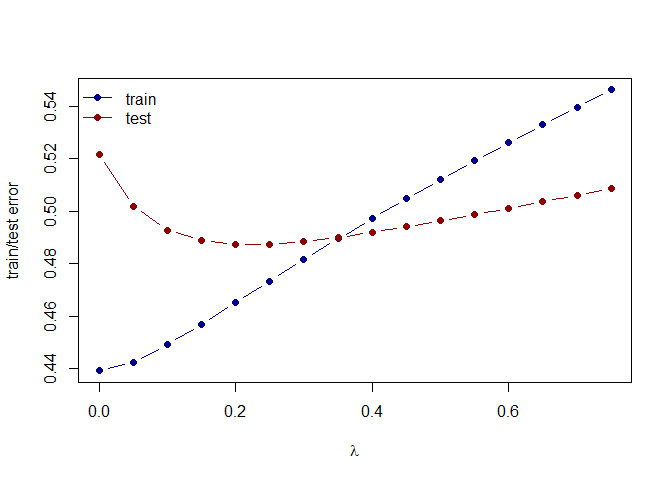

Homework 2
================
Anthony DeNiro
February 7, 2020

libraries

``` r
library(ElemStatLearn)
```

    ## Warning: package 'ElemStatLearn' was built under R version 3.6.2

``` r
library(magrittr)
library(dplyr)
```

    ## 
    ## Attaching package: 'dplyr'

    ## The following objects are masked from 'package:stats':
    ## 
    ##     filter, lag

    ## The following objects are masked from 'package:base':
    ## 
    ##     intersect, setdiff, setequal, union

``` r
library(glmnet)
```

    ## Warning: package 'glmnet' was built under R version 3.6.2

    ## Loading required package: Matrix

    ## Loaded glmnet 3.0-2

read in data

``` r
data('prostate')
```

training and testing sets

``` r
## split prostate into testing and training subsets
prostate_train <- prostate %>%
  filter(train == TRUE) %>% 
  select(-train)


prostate_test <- prostate %>%
  filter(train == FALSE) %>% 
  select(-train)
```

correlation coeficients

``` r
cor(prostate_train[1:8])
```

    ##             lcavol    lweight       age        lbph        svi         lcp
    ## lcavol  1.00000000 0.30023199 0.2863243  0.06316772  0.5929491  0.69204308
    ## lweight 0.30023199 1.00000000 0.3167235  0.43704154  0.1810545  0.15682859
    ## age     0.28632427 0.31672347 1.0000000  0.28734645  0.1289023  0.17295140
    ## lbph    0.06316772 0.43704154 0.2873464  1.00000000 -0.1391468 -0.08853456
    ## svi     0.59294913 0.18105448 0.1289023 -0.13914680  1.0000000  0.67124021
    ## lcp     0.69204308 0.15682859 0.1729514 -0.08853456  0.6712402  1.00000000
    ## gleason 0.42641407 0.02355821 0.3659151  0.03299215  0.3068754  0.47643684
    ## pgg45   0.48316136 0.07416632 0.2758057 -0.03040382  0.4813577  0.66253335
    ##            gleason       pgg45
    ## lcavol  0.42641407  0.48316136
    ## lweight 0.02355821  0.07416632
    ## age     0.36591512  0.27580573
    ## lbph    0.03299215 -0.03040382
    ## svi     0.30687537  0.48135774
    ## lcp     0.47643684  0.66253335
    ## gleason 1.00000000  0.75705650
    ## pgg45   0.75705650  1.00000000

linear model fitting lpsa outcome

``` r
fit <- lm(lpsa ~ ., data = prostate_train)
```

computing test error with L2 loss function for linear model

``` r
## functions to compute testing/training error w/lm
L2_loss <- function(y, yhat)
  (y-yhat)^2

error <- function(dat, fit, loss=L2_loss)
  mean(loss(dat$lpsa, predict(fit, newdata=dat)))


## testing error
error(prostate_test, fit)
```

    ## [1] 0.521274

ridge model fitting with lpsa outcome

``` r
## use glmnet to fit lasso
## glmnet fits using penalized L2 loss
## first create an input matrix and output vector
form  <- lpsa ~ 0 + lweight + age + lbph + lcp + pgg45 + lcavol + svi + gleason # 0 gives no intercept so glmnet doesnt penalize the intercept
x_inp <- model.matrix(form, data=prostate_train)
y_out <- prostate_train$lpsa

#?glmnet()
fit_ridge <- glmnet(x=x_inp, y=y_out, lambda= seq(0.75,0,-0.05), alpha = 0)
#print(fit_ridge$beta)
```

``` r
## plot path diagram
plot(x=range(fit_ridge$lambda),
     y=range(as.matrix(fit_ridge$beta)),
     type='n',
     xlab=expression(lambda),
     ylab='Coefficients')
for(i in 1:nrow(fit_ridge$beta)) {
  points(x=fit_ridge$lambda, y=fit_ridge$beta[i,], pch=19, col='#00000055')
  lines(x=fit_ridge$lambda, y=fit_ridge$beta[i,], col='#00000055')
}
abline(h=0, lty=3, lwd=2)
```



``` r
## functions to compute testing/training error with glmnet
error_ridge <- function(dat, fit, lam, form, loss=L2_loss) {
  x_inp <- model.matrix(form, data=dat)
  y_out <- dat$lpsa
  y_hat <- predict(fit, newx=x_inp, s=lam)  ## see predict.elnet
  mean(loss(y_out, y_hat))
}

## compute training and testing errors as function of lambda
err_train_1 <- sapply(fit_ridge$lambda, function(lam) 
  error_ridge(prostate_train, fit_ridge, lam, form))

err_test_1 <- sapply(fit_ridge$lambda, function(lam) 
  error_ridge(prostate_test, fit_ridge, lam, form))

## plot test/train error
plot(x=range(fit_ridge$lambda),
     y=range(c(err_train_1, err_test_1)),
     type='n',
     xlab=expression(lambda),
     ylab='train/test error')
points(fit_ridge$lambda, err_train_1, pch=19, type='b', col='darkblue')
points(fit_ridge$lambda, err_test_1, pch=19, type='b', col='darkred')
legend('topleft', c('train','test'), lty=1, pch=19,
       col=c('darkblue','darkred'), bty='n')
```



``` r
colnames(fit_ridge$beta) <- paste('lam =', fit_ridge$lambda)
#print(fit_ridge$beta %>% as.matrix)
```
